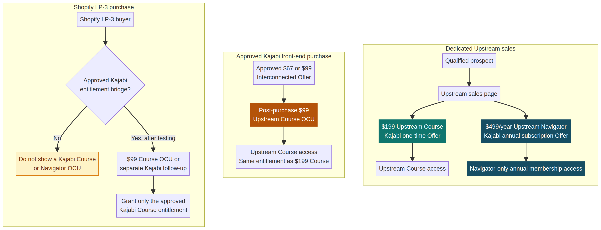

# Upstream Course and Navigator Offer Architecture

**Author:** Manus AI  
**Date:** 21 September 2026  
**Status:** Draft implementation brief. No sales page, Kajabi product, offer, checkout, price, upsell, email, automation, or traffic setting has been changed.

## Executive decision

The offer ladder has three distinct commercial paths. **Upstream Course** is the standalone self-guided education product at **\$199 one time**. The same Course may be offered at **\$99 one time** as a restricted post-purchase one-click upsell (OCU) for an approved qualifying buyer. **Upstream Navigator** is neither a bundle nor an upgrade by default. It is a separate **\$499-per-year annual subscription**, with its own product/SKU, access rules, buyer experience, reporting, and Klaviyo lifecycle.

> **Naming rule:** The annual membership is **Upstream Navigator**. Do not call it “Complete System,” do not describe it as a higher-priced version of the Course, and do not imply that it includes the Course unless that entitlement is deliberately approved and configured.

The practical implication is simple. The \$199 and \$99 purchases identify a **Course buyer**. The \$499 annual purchase identifies an **active Navigator member**. These are separate states, even if one person owns both.

## Product, SKU, and entitlement map

| Layer | Customer-facing name | Commercial model | Kajabi identity | Klaviyo identity | Entitlement |
|---|---|---|---|---|---|
| Core course | **Upstream Course** | Product, not a price | One Kajabi Product | `upstream_course` | Confirmed self-guided curriculum and confirmed Course resources only. |
| Standard course offer | **Upstream Course — Standard Access** | \$199 one-time purchase | One Kajabi Offer attached to `upstream_course` | Exact Course Offer ID and `upstream_course_199` reporting key | Course access. |
| Qualified-buyer OCU | **Upstream Course — Qualified Buyer OCU** | \$99 one-time post-purchase purchase | A second Kajabi Offer attached to the **same** Course Product, presented by a Kajabi Upsell | Exact OCU Offer ID and `upstream_course_99_ocu` reporting key | Exact same Course access as the \$199 offer. |
| Annual membership | **Upstream Navigator** | \$499 annual subscription | Separate Kajabi Product and separate Kajabi annual subscription Offer | Exact Navigator Offer ID and `upstream_navigator_annual_499` reporting key | Navigator-only curriculum, membership, and resources that are specifically verified and deliverable. |

Kajabi supports Offers that package one or more Products, and it also supports yearly subscription Offers. This structure deliberately uses separate Products because the Course and Navigator represent separate SKU, access, and lifecycle states—not merely different prices for the same access. [1] [2]

## Offer and lifecycle map



### Course paths

The Course has two price paths but one underlying Course entitlement.

| Path | Offer | Price | Buyer gets | Buyer does not automatically get |
|---|---|---:|---|---|
| Direct Course sale | Upstream Course — Standard Access | \$199 one time | Upstream Course access | Navigator membership or Navigator resources. |
| Qualifying Kajabi front-end buyer | Upstream Course — Qualified Buyer OCU | \$99 one time | The same Upstream Course access | Navigator membership or Navigator resources. |

The \$99 OCU is a restricted price path, not a third product. It should be shown only immediately after the owner-approved Kajabi source offer or offers. Kajabi presents an upsell after checkout, processes acceptance as a separate transaction using the original payment method, and grants access through the accepted Offer. [3] [4]

### Navigator annual path

The Navigator should have its own dedicated sales page and annual Kajabi checkout. It should use a **Subscription** payment type, charge **\$499 USD every year**, and retain member access until the subscription is cancelled or the Offer is revoked. [2]

The Navigator page must clearly answer five questions before asking for a purchase:

1. What exactly is the Navigator experience?
2. What content, access, interaction, resources, or support are exclusive to Navigator?
3. Who is it for, and who is better served by the self-guided Course?
4. What happens at the end of the first year and how is renewal handled?
5. What are the cancellation, refund, and access-after-cancellation terms?

Do not use generic words such as “personalized,” “guided,” “support,” “community,” “navigation,” or “implementation” unless the page defines the actual included deliverable, the delivery owner, the cadence, the access period, and the boundary.

### Shopify LP-3 path

Do **not** put the Kajabi \$99 Course OCU or the Navigator annual membership into the Shopify/Zipify post-purchase funnel until an approved and tested Shopify-to-Kajabi entitlement bridge exists. A Shopify payment does not automatically grant Kajabi Product access.

| Option | Buyer experience | First-release recommendation |
|---|---|---|
| Kajabi-only \$99 OCU | Qualifying buyers on an approved Kajabi source offer see a native Kajabi Course OCU and receive Course access automatically. | **Use first.** |
| Shopify post-purchase Kajabi checkout | A Shopify buyer is sent to a separate Kajabi checkout for the Course or Navigator. | Acceptable only as a deliberate second checkout; it is not one click. |
| Shopify OCU with Kajabi entitlement bridge | A Shopify buyer accepts an offer and is granted the matching Kajabi Product access. | Do not build or activate until payment, entitlement, refunds, cancellation, access email, and failure recovery are designed and tested. |

## Separate Kajabi and Klaviyo lifecycle contract

### Kajabi

| Record | Internal draft name | Price and billing | Access model | Required status at first review |
|---|---|---|---|---|
| Course Product | `[DRAFT] Upstream Course` | Not applicable | Self-guided Course only | Draft |
| Course Offer | `[DRAFT] Upstream Course — Standard — 199 USD` | One time, \$199 | Grants Course Product | Draft |
| Course OCU Offer | `[DRAFT] Upstream Course — Qualified Buyer OCU — 99 USD` | One time, \$99 | Grants the same Course Product | Draft and unattached |
| Navigator Product | `[DRAFT] Upstream Navigator` | Not applicable | Navigator-only entitlement | Draft |
| Navigator Offer | `[DRAFT] Upstream Navigator — Annual — 499 USD/year` | Subscription, \$499 every year | Grants Navigator Product only, unless a separate Course inclusion is approved | Draft |

The annual Navigator Offer must have its own exact Offer ID. That exact ID, not the public title or price, is the authoritative identity used by all automation, reporting, and customer-state rules.

### Klaviyo

Klaviyo must receive or recognize Navigator as a discrete purchase and membership state. Build no live flow yet. First create this registry and verify its source data against a real **draft** offer configuration:

| Lifecycle | Exact inclusion rule | Reporting key | Permitted messaging role |
|---|---|---|---|
| Course buyer | Native purchase event or integration event with the exact \$199 Course Offer ID | `upstream_course_199` | Course access, activation, learning engagement, Course-related follow-up. |
| Course OCU buyer | Exact \$99 OCU Course Offer ID | `upstream_course_99_ocu` | Same Course activation path, with source-price reporting preserved. |
| Active Navigator member | Exact annual Navigator Offer ID plus an active subscription/payment state | `upstream_navigator_annual_499` | Navigator onboarding, member-value communications, renewal education, and approved member-only content. |
| Navigator renewal | Exact Navigator Offer ID and a successful renewal event | `upstream_navigator_renewal` | Receipt or value-reinforcement messages only after the event source and consent architecture are verified. |
| Navigator cancellation or failed renewal | Exact Navigator Offer ID and a verified cancellation/failure event | `upstream_navigator_lapsed` | Access, account, and reactivation communications only after legal/consent and platform event behavior are verified. |

Do not use broad tags such as “Upstream,” text matching in a product title, or price alone as the trigger. Use the exact Kajabi Offer ID plus the applicable subscription status. The existing Content Hub Kajabi purchase normalizer already captures offer IDs from Kajabi payment payloads, which makes exact-offer reporting feasible once the Navigator Offer is created. [5]

## Sales-page requirements

### Upstream Course — \$199 one-time page

The Course page should explain the self-guided framework before displaying the price. It should state the confirmed curriculum, access expectations, learning cadence, resources, and educational boundaries. It should make the Course feel complete for its intended buyer. It must not be framed as an inadequate teaser for Navigator.

**Primary CTA:** `Start Upstream`  
**Destination:** approved Kajabi \$199 Course checkout.

### Upstream Navigator — \$499/year page

The Navigator page should describe a separate annual membership. It should compare Navigator with the Course using only confirmed differences. It should make the annual recurring charge prominent near the CTA, state the renewal cadence, link to cancellation/refund terms, and state what happens to access after a cancellation or failed renewal.

**Primary CTA:** `Join Upstream Navigator — \$499/year`  
**Destination:** approved Kajabi annual Navigator checkout.

### Upstream Course OCU — \$99 post-purchase page

The OCU page should make one decision easy. The buyer has just taken a first step and can add the self-guided Upstream Course at the restricted post-purchase price. It should list confirmed Course inclusions and clearly show that Navigator is not included.

**Acceptance CTA:** `Yes, add Upstream for \$99`  
**Decline CTA:** `No thanks, continue to my access`

No invented countdown, fabricated scarcity, unrelated upsell, medical claim, diagnosis, cure, treatment promise, or guaranteed outcome may appear on any page.

## Facts that must be locked before public release

| Required decision | Why it is required |
|---|---|
| Exact Course curriculum, resources, and access duration | Defines the promise on both the \$199 and \$99 Course paths. |
| Exact Navigator-only deliverables and annual access rules | Defines the distinct \$499/year membership value. |
| Whether Navigator includes Course access | Default architecture: **no**. If yes, that must be a deliberate, documented entitlement change. |
| Navigator renewal, cancellation, refund, failed-payment, and post-cancellation access policy | Required for the sales page, checkout, support, and lifecycle copy. |
| The approved Kajabi source offer or offers for the \$99 OCU | Prevents the OCU appearing in the wrong buyer journey. |
| Exact product IDs, offer IDs, checkout URLs, and post-purchase destinations | Required for CTA safety and exact-offer automation. |
| The actual Kajabi-to-Klaviyo subscription and renewal event fields | Required before any Navigator flow is built or enabled. |
| Shopify-to-Kajabi entitlement design | Required before Shopify buyers can be sold Kajabi access. |

## Measurement contract

Keep **\$199 Course**, **\$99 Course OCU**, **new Navigator annual starts**, **Navigator renewals**, **Navigator cancellations**, and **Navigator failed payments** as six distinct metrics. Do not merge Course buyers and active Navigator members. Do not treat a Course transaction as Navigator annual recurring revenue. Do not treat a Navigator annual payment as Course revenue unless Navigator is explicitly configured to grant Course access and that inclusion is separately reported.

Kajabi is the financial authority for Kajabi payments. Shopify is the financial authority for Shopify payments. Klaviyo is a messaging and segmentation layer, not the revenue authority.

## Copy-ready implementation prompt

```text
We are updating the Urban Monk’s Upstream offer architecture. Work in the existing project and its connected Kajabi and Klaviyo accounts. Do not create a new project.

The commercial decision is final:
- Upstream Course is a standalone self-guided product at 199 USD, one-time payment.
- Upstream Course may also be offered at 99 USD, one-time payment, only as a restricted post-purchase OCU for an approved qualifying buyer. This OCU grants the same Course access as the 199 USD Course Offer.
- Upstream Navigator is a distinct annual membership at 499 USD per year. It has its own Kajabi Product, its own Kajabi annual subscription Offer, its own SKU/reporting identity, and its own Klaviyo lifecycle.
- Navigator is not a bundle or an upgrade by default. Do not attach the Course to Navigator or claim Course access until the owner explicitly confirms that Navigator includes the Course.
- Do not call Navigator “Complete System.”

WORKING MODE AND SAFETY
1. Build sales pages as preview/draft pages first.
2. Create Kajabi Products, Offers, Upsells, Klaviyo segments, and Klaviyo flows in DRAFT only. Do not publish, activate, attach an OCU to a live offer, send a message, change price, alter checkout, modify an existing automation, alter Shopify, change tracking, change traffic, or change DNS without separate written approval.
3. Before creating anything, audit existing Upstream products, offers, subscription records, and Klaviyo purchase/subscription event fields. Reuse the correct existing product only when its confirmed access and content match the new definition.
4. Do not invent curriculum items, bonuses, community, consultation, coaching, testing, outcomes, guarantees, refunds, cancellation terms, scarcity, reviews, testimonials, or health claims. Mark missing facts as OWNER INPUT REQUIRED and omit them from public copy.
5. Keep health language educational. Do not claim diagnosis, treatment, cure, prevention, guaranteed outcomes, or that a test will find a root cause.

DELIVERABLE A — READ-ONLY INVENTORY
Return a concise table with:
- all existing Upstream Course products and offers, including price, access, status, offer ID, and checkout URL;
- all existing Navigator products and offers, including price, access, subscription state, status, offer ID, and checkout URL;
- the current Kajabi Interconnected 67 USD and 99 USD source offers, including exact offer IDs and present post-purchase upsells;
- the Kajabi-to-Klaviyo purchase, renewal, cancellation, and failed-payment event fields available for exact-offer segmentation;
- every missing fact that prevents accurate public copy or reliable annual-member automation.

Make no live change during this audit.

DELIVERABLE B — DRAFT KAJABI CATALOG
After the inventory is reviewed, create the following records in DRAFT only. Create an internal registry with final product IDs, offer IDs, preview checkout URLs, entitlement keys, price, billing type, and post-purchase setting.

1. PRODUCT: [DRAFT] Upstream Course
   - Create only if no suitable existing Course Product exists.
   - Add only confirmed Course modules, resources, and access settings.

2. OFFER: [DRAFT] Upstream Course — Standard — 199 USD
   - Attach Upstream Course.
   - One-time payment: 199 USD.
   - Draft status. No new marketing automation.

3. OFFER: [DRAFT] Upstream Course — Qualified Buyer OCU — 99 USD
   - Attach the SAME Upstream Course Product.
   - One-time payment: 99 USD.
   - Create a separate reusable Kajabi Upsell page with OCU-specific copy.
   - Draft status. Do not attach it to any live source offer until I explicitly name and approve the source offer or offers.

4. PRODUCT: [DRAFT] Upstream Navigator
   - This is separate from the Course Product.
   - Add only verified Navigator-specific curriculum, membership components, resources, and access terms.
   - Do not include Course access unless I explicitly approve it.

5. OFFER: [DRAFT] Upstream Navigator — Annual — 499 USD/year
   - Attach the Upstream Navigator Product.
   - Payment type: Subscription.
   - Amount: 499 USD.
   - Billing interval: yearly.
   - Do not add a trial, setup fee, or Course Product unless I explicitly approve each one.
   - Draft status. Set no public destination and activate no automation.

6. Do not create Course-to-Navigator upgrade offers unless I separately approve an upgrade-credit policy.

DELIVERABLE C — DRAFT KLAVIYO LIFECYCLE
Create a draft-only segmentation and flow specification. Do not turn on any flow or send any message.

1. Segment or trigger definition: Upstream Course 199 Buyer
   - Trigger only from the exact 199 USD Course Offer ID.
   - Reporting key: upstream_course_199.

2. Segment or trigger definition: Upstream Course 99 OCU Buyer
   - Trigger only from the exact 99 USD OCU Offer ID.
   - Reporting key: upstream_course_99_ocu.

3. Segment or trigger definition: Active Upstream Navigator Annual Member
   - Trigger only from the exact Navigator annual Offer ID plus verified active subscription/payment state.
   - Reporting key: upstream_navigator_annual_499.

4. Prepare, but do not activate, Navigator lifecycle branches for: successful initial annual payment; successful annual renewal; cancellation; payment failure; and access expiration.
   - First prove the exact Kajabi/Klaviyo event names and fields for each state.
   - Do not use a loose product-name match, a tag alone, or price alone as a trigger.
   - Do not mix Course and Navigator communications.

5. Prepare an owner-review table that shows the intended message purpose, exact entry event, exclusions, consent requirement, and exit condition for each draft branch.

DELIVERABLE D — PREVIEW-ONLY SALES PAGES
Build three preview pages in the existing Urban Monk visual system. Keep checkout CTAs disabled or linked only to clearly labeled preview placeholders until I approve exact destinations.

PAGE 1: Upstream Course — 199 USD
- Explain the self-guided framework and confirmed inclusions.
- State access expectations and educational boundaries.
- Make clear that the Course is complete for a self-guided buyer.
- Primary CTA: Start Upstream.

PAGE 2: Upstream Navigator — 499 USD/year
- Present Navigator as a separate annual membership.
- State exactly what is included, for whom it is intended, the annual billing cadence, and the relevant cancellation/refund/access terms once verified.
- Include a factual comparison with the Course, based only on confirmed differences.
- Primary CTA: Join Upstream Navigator — 499 USD/year.

PAGE 3: Upstream Course OCU — 99 USD
- Keep this post-purchase page short and focused.
- Show the normal 199 USD Course price and the restricted post-purchase 99 USD price only after the pricing policy is approved.
- State that it includes the Course, not Navigator.
- Acceptance CTA: Yes, add Upstream for 99 USD.
- Decline CTA: No thanks, continue to my access.

DESIGN REQUIREMENTS
- Use the established Urban Monk visual language: calm dark blue-green context areas, warm white reading canvas, clear teal CTA buttons, high contrast, and strong mobile spacing.
- Make the annual recurring charge prominent on every Navigator page and checkout handoff.
- Create a named CTA-destination registry. Do not scatter or invent checkout URLs.

PLATFORM BOUNDARIES
- The 99 USD Course OCU may be configured only on approved Kajabi source offers in the first release.
- Do not place the Kajabi Course OCU or Navigator annual membership into Shopify/Zipify until a separately approved and tested Shopify-to-Kajabi entitlement bridge exists.
- If asked to add Shopify parity later, first present a design covering payment idempotency, email/customer matching, Kajabi entitlement grant and revocation, annual renewal/cancellation state, refunds, access email ownership, failure recovery, and a no-charge test plan.
- Keep the current Interconnected 67 USD/99 USD price test separate from this offer build.

MEASUREMENT REQUIREMENTS
- Keep Course 199, Course 99 OCU, Navigator annual starts, Navigator annual renewals, Navigator cancellations, and Navigator payment failures as separate paths.
- Use exact Offer IDs as the reporting key and keep a product/offer registry.
- Kajabi is the financial authority for Kajabi payments. Klaviyo is the messaging and segmentation layer only.

REQUIRED REVIEW BEFORE ANY PUBLICATION
Before asking for publication or activation, provide:
1. the Kajabi product/offer registry with draft IDs and preview URLs;
2. the confirmed Course-versus-Navigator inclusion matrix;
3. the annual billing, cancellation, refund, access, and renewal policy;
4. the Klaviyo event-field map and draft flow-entry/exclusion table;
5. the three preview-page URLs and desktop/mobile screenshots;
6. the exact proposed source offer or offers for the Course OCU;
7. all unresolved facts and placeholders; and
8. a test plan without a real charge plus a rollback plan.

Stop after the draft build and review. Do not publish, attach an OCU to a live offer, enable a Klaviyo flow, send email, change the front-end funnel, or make a traffic change.
```

## References

[1]: https://help.kajabi.com/articles/sales/offers/create-an-offer "Kajabi Help Center — Create an Offer"
[2]: https://help.kajabi.com/articles/sales/offers/how-to-create-a-subscription-offer "Kajabi Help Center — Create a Subscription Offer"
[3]: https://help.kajabi.com/articles/sales/offers/manage-upsells-in-the-purchase-flow "Kajabi Help Center — Manage Upsells in the Purchase Flow"
[4]: https://help.kajabi.com/articles/sales/offers/what-happens-when-a-customer-purchases-my-offer "Kajabi Help Center — Customer Offer Purchase Experience"
[5]: https://theacademy.theurbanmonk.com/products/interconnected-series-self-guided "The Urban Monk Academy — Interconnected Series Self Guided"
